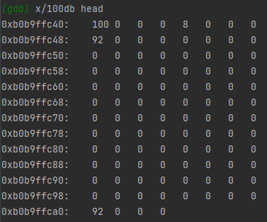
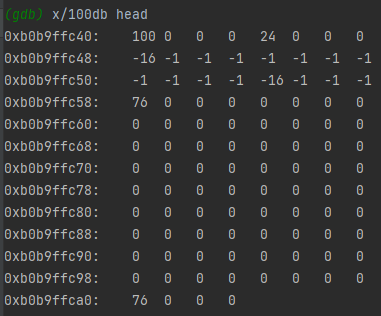
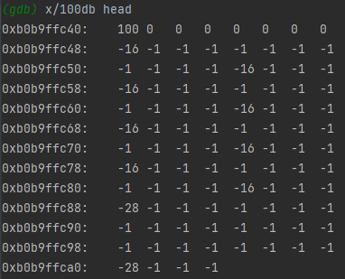
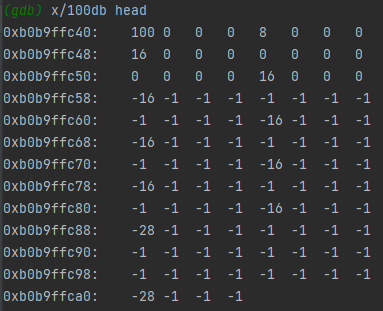
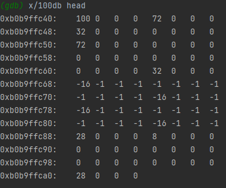

# FIRST ASSIGNMENT FROM DATA STRUCTURES AND ALGORITHMS
## SLOVAK TECHNICAL UNIVERSITY - FACULTY OF INFORMATICS AND INFORMATION TECHNOLOGY

---
Refactored version of first assignment, logic stayed mostly the same, but made it much more readable.
# Explicit list memory allocation
This is implementation of explicit memory list.

Good video explanation on this topic in this [link](https://www.youtube.com/watch?v=rhLk2lf6QXA)  

## Memory block schema:
- free block

| 4B     | 4B              | 4B                  | 4B     |
|--------|-----------------|---------------------|--------|
| Header | Next free block | Previous free block | Footer |

- allocated block (minimal payload size 8B)

| 4B     | Payload | 4B     |
|--------|---------|--------|
| Header | Payload | Footer |

## Main code functions:
### memoryInnit - initializes memory for use in this implementation
  - 
  - first four bytes (integer) is memory size, 
  - second four bytes (integer) is first free block pointer
  - then first free block follows, it spans whole memory
### memoryAlloc - function that will alloc block with desired size
  - 
  - allocated block of 8 bytes of memory (+ 8 with heater and footer)
  - first two rows of memory are allocated and first free block pointer was changed
### memoryFree - function that will free allocated block
-   
- few steps of memory freeing

# Code snippets
For finding blocks I use best fit algorithm. That finds block that has the closest free block size to desired size. 
```c
int bestFit(const int newBlockSize) {
    int freeBlockHead = getIntFromRegion(FIRST_FREE_BLOCK_LOCATION);
    if (freeBlockHead == EMPTY) {
        return EMPTY;
    }
    int freeBlockSize = getIntFromRegion(freeBlockHead);
    int bestBlockHead = EMPTY;
    int bestBlockSize = freeBlockSize;
    // if free block does not have pointer (it is 0) to next block it is last block
    while (freeBlockHead != EMPTY) {
        // if we found exact block we were looking for
        if (freeBlockSize == newBlockSize) {
            bestBlockHead = freeBlockHead;
            break;
        }
        // if block is big enough and is closer to desired size
        else if (freeBlockSize > newBlockSize && freeBlockSize <= bestBlockSize) {
            bestBlockHead = freeBlockHead;
            bestBlockSize = freeBlockSize;
        }
        freeBlockHead = getHeadOfNextFreeBlock(freeBlockHead);
        freeBlockSize = getIntFromRegion(freeBlockHead);
    }
    return bestBlockHead;
}
```

For better code readability I added few definitions:
```c
#define INT_SIZE (int)sizeof(int)
#define MIN_MEMORY_SIZE 24
#define MIN_BLOCK_SIZE 16
#define SIZE_OF_HEAD_WITH_TAIL 2 * (int)sizeof(int)
#define FIRST_FREE_BLOCK_LOCATION 4
#define EMPTY 0
```

# Tests
## Code contains two types of tests
### Manual allocation and free test
- simple test of allocating five blocks and freeing ones that are not commented out
- it is good for logic testing and simulating scenarios
- at the end prints out message about fragmentation
```c
void test(const int SIZE) {
    const int BLOCK_SIZE = 8;
    char region[SIZE];

    memoryInnit(region, SIZE);

    // list of all blocks
    void* blockArray[5] = {NULL};
    blockArray[0] = memoryAlloc(BLOCK_SIZE);
    blockArray[1] = memoryAlloc(BLOCK_SIZE);
    blockArray[2] = memoryAlloc(BLOCK_SIZE);
    blockArray[3] = memoryAlloc(BLOCK_SIZE);
    blockArray[4] = memoryAlloc(BLOCK_SIZE);

    int allocatedBlocksCount = 0;
    for (int i = 0; i < sizeof(blockArray) / sizeof(blockArray[0]); ++i) {
        if (blockArray[i] != NULL) {
            allocatedBlocksCount++;
        }
    }

    memoryFree(blockArray[0]);
//    memoryFree(blockArray[3]);
    memoryFree(blockArray[1]);
//    memoryFree(blockArray[2]);
    memoryFree(blockArray[4]);

    // number of all free bytes including headers and footers
    int remainingMemory = 0;
    // number of all free bytes excluding headers and footers
    int realRemainingMemory = 0;
    int freeBlocksCount = 0;

    int firstFreeBlock = getIntFromRegion(FIRST_FREE_BLOCK_LOCATION);
    // if there are remaining free blocks
    if (firstFreeBlock != EMPTY) {
        int freeBlockHead = firstFreeBlock;
        int freeBlockSize;
        // count all the memory
        while (freeBlockHead != EMPTY) {
            freeBlocksCount++;
            freeBlockSize = getIntFromRegion(freeBlockHead);
            remainingMemory+= freeBlockSize;
            realRemainingMemory+= freeBlockSize - SIZE_OF_HEAD_WITH_TAIL;
            freeBlockHead = getHeadOfNextFreeBlock(freeBlockHead);
        }
    }
    int expectedSize = SIZE - (allocatedBlocksCount - freeBlocksCount) * BLOCK_SIZE;
    float fragmentation = ((float) remainingMemory / (float) expectedSize) * 100;

    printf("Starting memory size was %d.\n", SIZE);
    printf("Remaining memory after allocating %d and freeing %d blocks of size %d was %d bytes.\n",
           allocatedBlocksCount, freeBlocksCount, BLOCK_SIZE, remainingMemory);
    printf("Expected free memory size would be %d bytes\n", expectedSize);
    printf("Fragmentation was %lf %%. \n\n", fragmentation);
}
```
### Random allocation test
- random test of allocating 5 blocks with given minimal and maximal size
- at the end prints out message about fragmentation
```c
void testRandom(const int SIZE, const int MIN, const int MAX ) {
    char region[SIZE];
    const int NUMBER_OF_BLOCKS = 5;
    void* blockArray[NUMBER_OF_BLOCKS];
    for (int i = 0; i < NUMBER_OF_BLOCKS; ++i) {
        blockArray[i] = NULL;
    }

    memoryInnit(region, SIZE);

    // allocation of 5 blocks
    int allocatedBlocksCount = 0;
    int allocatedSize = 0;
    int realAllocatedSize = 0;
    int randomSize;
    for (int i = 0; i < NUMBER_OF_BLOCKS; ++i) {
        randomSize = MIN + (rand() % (MAX - MIN + 1));
        blockArray[i] = memoryAlloc(randomSize);
        if (blockArray[i] != NULL) {
            realAllocatedSize += -getIntFromRegion(getPointerLocation(blockArray[i]));
            allocatedSize += -getIntFromRegion(getPointerLocation(blockArray[i])) - SIZE_OF_HEAD_WITH_TAIL;
            allocatedBlocksCount++;
        }
    }

    float fragmentation = ((float) allocatedSize / (float) realAllocatedSize) * 100;

    printf("Tried to allocate %d blocks. Successfully allocated %d Blocks.\n", NUMBER_OF_BLOCKS, allocatedBlocksCount);
    printf("Original memory size was %d. Remaining memory size after allocation of blocks with random size was %d bytes, in ideal contitions it would be %d bytes.\n",
           SIZE,  SIZE - realAllocatedSize - 2 * INT_SIZE, SIZE - allocatedSize - 2 * INT_SIZE);
    printf("Fragmentation was %lf %%. \n\n", fragmentation);

    memset(head, 0, SIZE);
}

```


